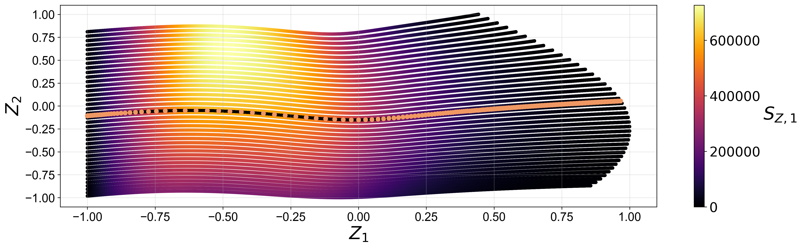
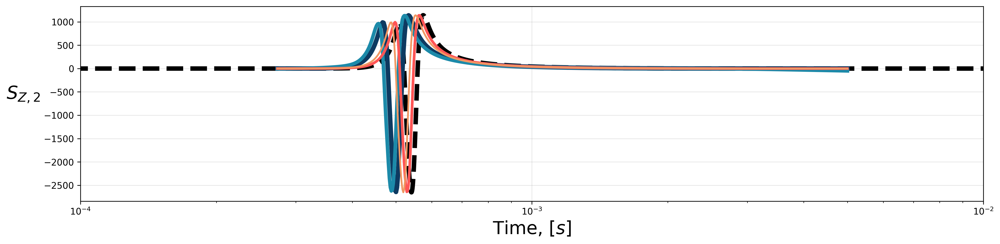
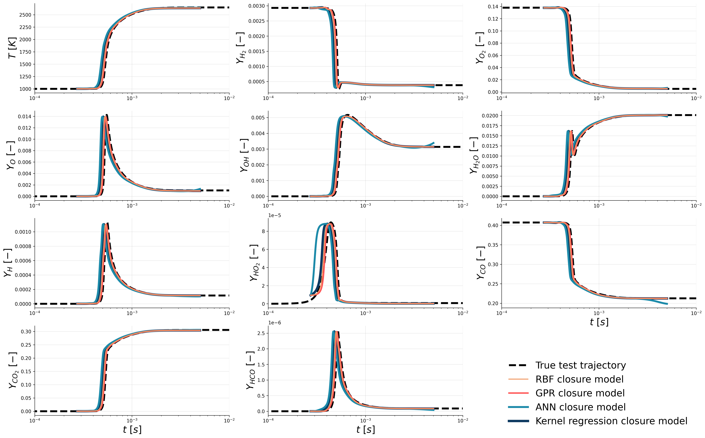
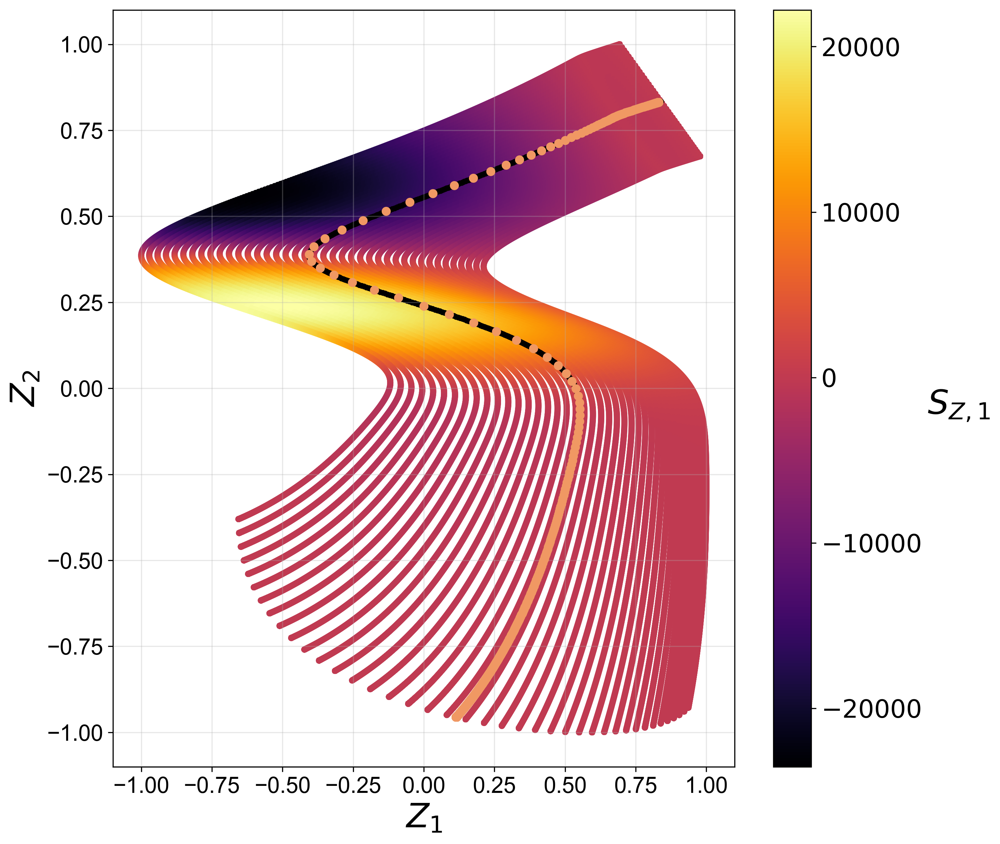
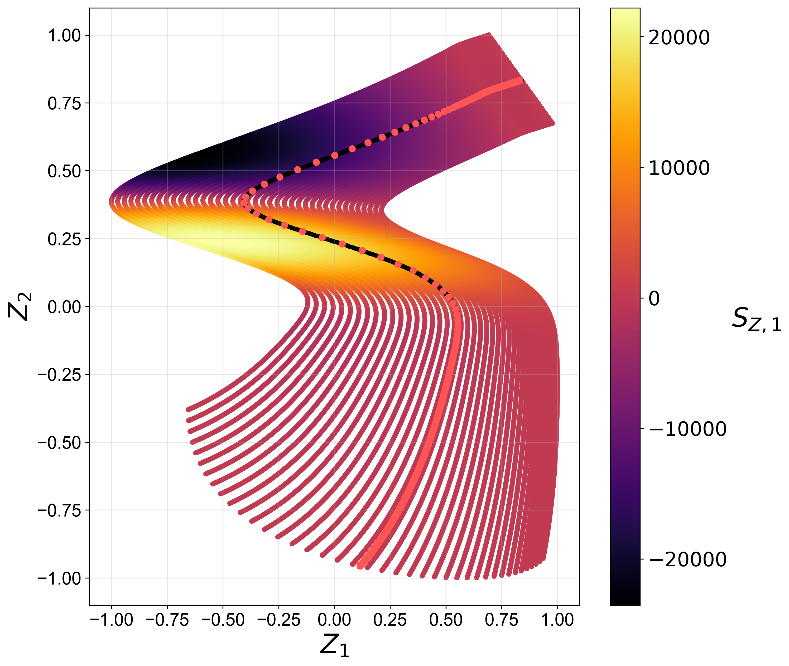
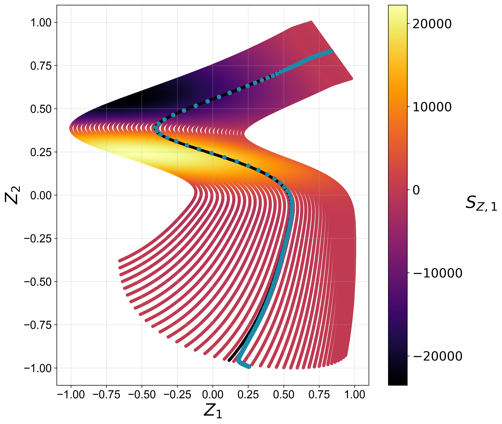
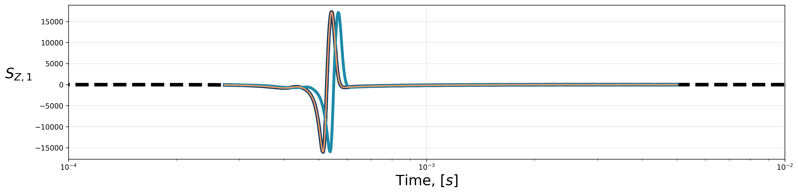
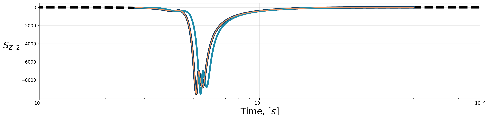
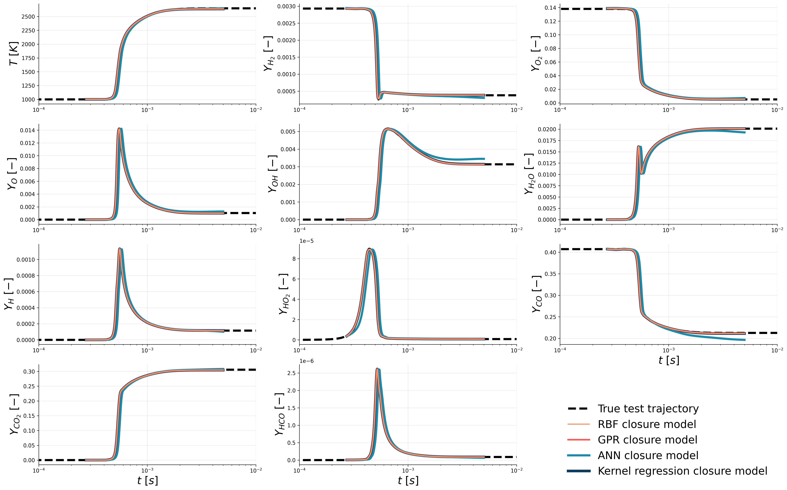

# Reduced-order model for a zero-dimensional reactor

Code and materials that accompany Chapter 8 from my dissertation: *Reduced-order model for a zero-dimensional reactor*.

## Data

The [`data/`](data) directory stores the training dataset corresponding to combustion of syngas in air. The dataset is generated using the zero-dimensional reactor model.

## Code

The [`code/`](code) directory stores Python code that can be used to reproduce results from my dissertation.

Results in Chapter 8 have been generated with the following Python package versions:

```
numpy version:		1.21.6
scipy version:		1.7.3
george version:		0.4.0
tensorflow version:	2.11.0
keras version:		2.11.0
PCAfold version:	1.6.0
```

### Transport of PCA-derived manifold parameters: [`PC-transport.py`](code/PC-transport.py)

Running this script on your PC takes about 150 minutes. If you want much quicker results (of the order of 15 minutes), consider not running GPR (set `run_GPR = False`).

### Transport of regression-aware AE-derived manifold parameters: [`AE-transport.py`](code/AE-transport.py)

Running this script on your PC takes about 10 hours. If you want much quicker results (of the order of 15 minutes), consider not running GPR (set `run_GPR = False`).

### Visualizing the results

This [Jupyter notebook](code/PC-transport-results.ipynb) can be used to upload and visualize the results of the [`PC-transport.py`](code/PC-transport.py) script.

This [Jupyter notebook](code/AE-transport-results.ipynb) can be used to upload and visualize the results of the [`AE-transport.py`](code/AE-transport.py) script.

## Results

The [`results/`](results) directory stores figures and results in `.csv` files.

### PC-transport

#### Test trajectory transported using PC-transport with the RBF closure model



#### Test trajectory transported using PC-transport with the GPR closure model


#### Test trajectory transported using PC-transport with the ANN closure model


#### Test trajectory transported using PC-transport with the kernel regression closure model


#### *A posteriori* predictions of the first and second projected source terms




#### Predicted thermo-chemistry



### AE-transport

#### Test trajectory transported using AE-transport with the RBF closure model



#### Test trajectory transported using AE-transport with the GPR closure model



#### Test trajectory transported using AE-transport with the ANN closure model



#### Test trajectory transported using AE-transport with the kernel regression closure model


#### *A posteriori* predictions of the first and second projected source terms





#### Predicted thermo-chemistry


